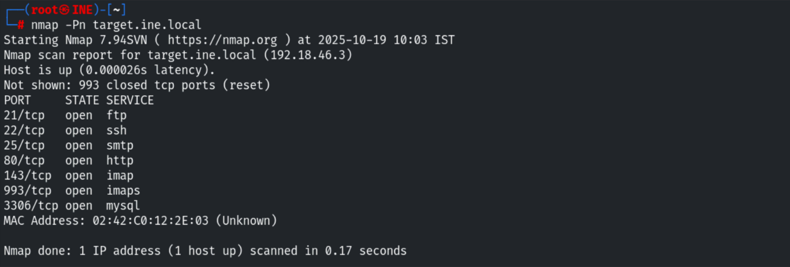
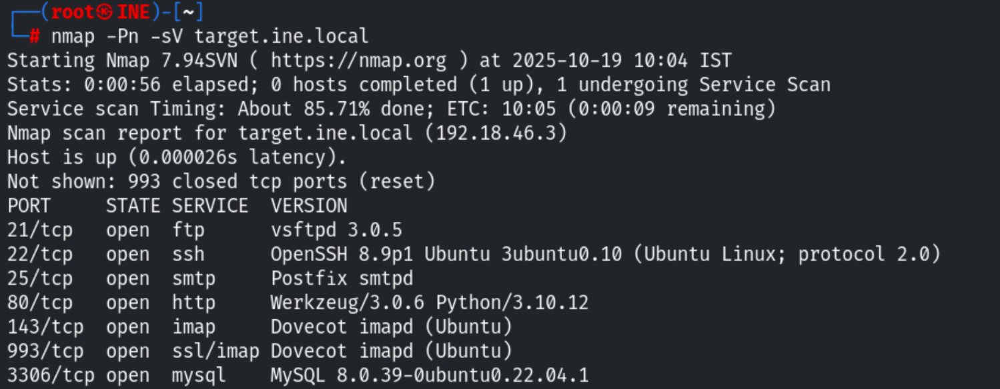
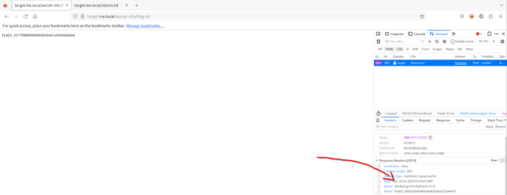
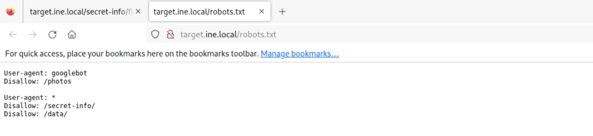
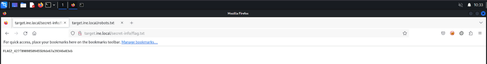
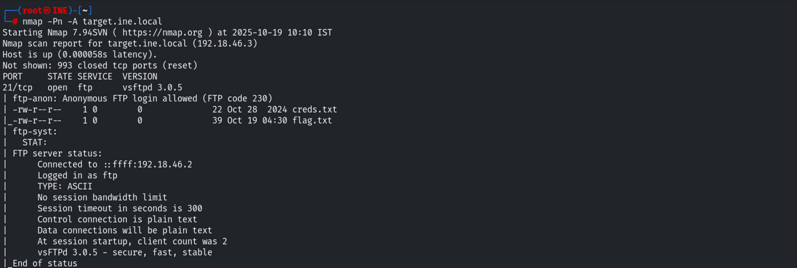
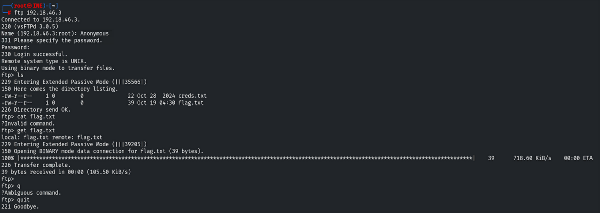
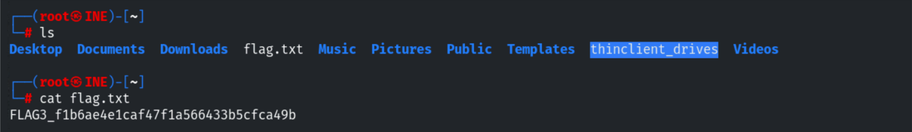
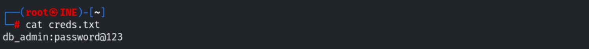
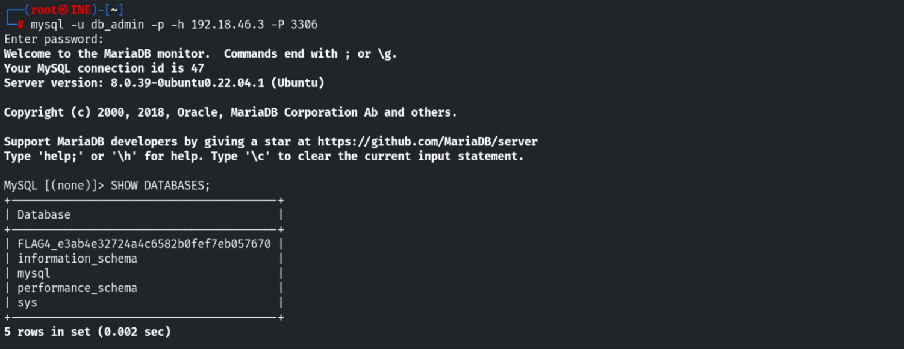

# CTF Report: Service Enumeration & Misconfiguration Exploitation

**Date:** October 2025<br>
**Classification:** Assessment Methodologies / Footprinting<br>
**Target IP:** 192.18.46.3 (target.ine.local)


## 1. Executive Summary

During the security assessment of host **192.18.46.3**, multiple critical misconfigurations were identified. The target exposed sensitive information through **improper server headers**, allowed **anonymous FTP access** leading to credential theft, and exposed hidden directories via ***robots.txt***. These vulnerabilities facilitated a full chain of exploitation, resulting in unauthorized access to the MySQL database.

## 2. Reconnaissance & Scanning

An initial port scan was performed to identify the attack surface.

### Network Discovery

Using `nmap`, we identified open services including FTP, SSH, SMTP, HTTP, IMAP, and MySQL.

```bash 
nmap -Pn -sV target.ine.local
```




## 3. Web Service Enumeration (HTTP)

Targeting port 80, we analyzed the web server configuration and directory structure.

### Information Disclosure via Headers (Flag 1)

Upon inspecting the HTTP Response Headers, the server failed to obscure its identity. The **Server** header contained non-standard information, revealing the first flag.



### Directory Traversal via Robots.txt (Flag 2)

We inspected `robots.txt` to find disallowed paths. This file inadvertently acted as a map to sensitive directories.

- **Finding:** `Disallow: /secret-info/`



Accessing this directory revealed the second flag.



## 4. Exploitation: FTP & Lateral Movement

Targeting port 21, we identified a critical authentication vulnerability.

### Anonymous FTP Access (Flag 3)

The `vsftpd 3.0.5` service was configured to allow **Anonymous** login.

```bash 
nmap -Pn -A target.ine.local
```



We connected to the FTP server, listed the directory, and ex-filtrated sensitive files (`flag.txt` and `creds.txt`).

**Commands:** 
```bash 
ftp 192.18.46.3 
Name: anonymous 
Password: [blank] 
get flag.txt 
get creds.txt 
```



Reading the local file confirmed the capture of the third flag.



### Credential Dumping

The `creds.txt` file retrieved from the FTP server contained clear-text credentials for the database administrator.

- **User:** db_admin
- **Password:** password@123



## 5. Post-Exploitation: Database Enumeration (Flag 4)

Using the compromised credentials, we pivoted to the MySQL service on port 3306.

```bash 
mysql -u db_admin -p -h 192.18.46.3 -P 3306
```

Upon successful authentication, we enumerated the databases. The fourth flag was hidden within the database schema naming convention.

```sql 
SHOW DATABASES;
```



## 6. Security+ Remediation Recommendations

To mitigate these vulnerabilities, the following hardening steps are recommended:

1. **Disable Anonymous FTP:** Modify `vsftpd.conf` to set `anonymous_enable=NO`. Transition to SFTP (SSH) for secure file transfer to prevent unauthorized access.
2. **Server Header Hardening:** Configure the web server (Werkzeug/Python) to suppress or generalize the `Server` header (Security through Obscurity) to prevent information leakage.
3. **Access Control:** `robots.txt` is not a security control. Sensitive directories like `/secret-info/` should be protected by authentication (403 Forbidden / 401 Unauthorized), not just hidden from crawlers.
4. **Database Security:**
    - Disable remote root/admin login.
    - Bind the database service to `localhost` (127.0.0.1) if remote access is not strictly required.
    - Enforce strong password policies and avoid storing credentials in clear-text files on public shares.